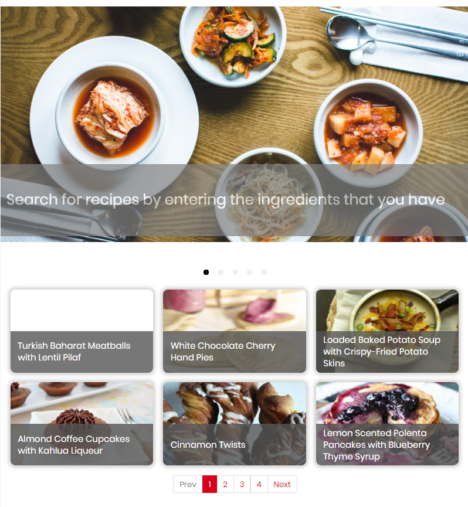

##Charakterystyka projektu

**FoodHUB** - aplikacja webowa wspomagająca wybór przepisu kulinarnego.

Projekt został zrealizowany w formie aplikacji SPA przy użyciu frameworka Vue.js. Interfejs użytkownika jest przyjazny zarówno dla urządzeń stacjonanych jak i mobilnych.

Aplikacja ma za zadanie wyszukać w swojej bazie odpowiedni przepis ([spoonacular API](https://spoonacular.com/food-api)), na podstawie składników podanych przez użytkownika.

Każdy przepis zawiera pełną listę składników potrzebnych do jego wykonania oraz instrukcję wykonania. Znajdują się także inne podstawowe informacje dotyczące wybranego dania.

Zalogowanie do aplikacji umożliwia przeglądanie historii wyszukiwanych przepisów oraz dodawanie przepisów do ulubionych. Istnieje również możliwość korzystanie z aplikacji bez logowania, lecz z ograniczoną funkcjonalnością (wyłącznie wyszukiwanie przepisów).

Do zapisywania profili użytkowników, ich danych oraz preferencji (ulubione przepisy), została wykorzystana baza danych oraz autentykacja przy pomocy **Firebase**. 

-------------------

##Zasadnicze funkcjonalności aplikacji

Istnieją dwie możliwości wyszukania przepisów: 
- po nazwie dania, 
- lub z użyciem wprowadzonej listy składników oraz słów kluczowych.

Pierwsza możliwość jest dostępna z poziomu górnego paska nawigacyjnego, zawierającego dostęp do głównych funkcjonalności aplikacji (**Rys. 1**). Wystarczy w polu tekstowym wpisać pożądaną frazę, a następnie nacisnąć ikonę lupy w celu wyszukania przepisów.

***Rys. 1** - Górny pasek nawigacyjny*

Drugą możliwością jest wybór konkretnych składników i słów kluczowych. Po naciśnięciu *Ingredients* na pasku wyszukiwania, pojawi się druga część górnego paska nawigacyjnego - strefa wyszukiwania (**Rys. 2**). Użytkownik w polach tekstowych wpisuje pożądane oraz niepożądane w przepisie składniki, których dodanie zatwierdza przyciskiem "+" lub "-". Można również podać słowa kluczowe dla szukanego przepisu. Po wybraniu i zatwierdzeniu wszystkich kryteriów, należy wyszukać przepisy przyciskiem "Search".

***Rys. 2** - Strefa wyszukiwania wypełniona składnikami*

Wyniki wyszukiwania zostaną wyświetlone użytkownikowi w postaci kafelków z ilustracją oraz tytułem przepisu (**Rys. 3**). W górnej części znajduje się informacja o liczbie wyszukanych przepisów oraz lista wprowadzonych wcześniej składników (jeśli wyszukiwanie odbywało się ścieżką z wyborem składników).

***Rys. 3** - Widok wyników wyszukiwania*

Po kliknięciu w wybrany przepis użytkownik zostanie przeniesiony do jego szczegółów (**Rys. 4**). Widok ten jest podzielony na 4 sekcje:
- ogólne informacje o przepisie,
- lista składników,
- wskazówki wykonania,
- fakty żywieniowe.

Podczas wykonywania przepisu jest możliwość odznaczania wykorzystanych już składników bądź wykonanych kroków.

***Rys. 4** - Widok szczegółów przepisu*

Do zalogowania służy przycisk *SIGN IN*, znajdujący się na pasku nawigacyjnym (**Rys. 1**). Po jego kliknięciu pojawi się okno modalne z formularzem logowania lub zakładania konta w aplikacji (**Rys. 5**). Możliwe jest logowanie przy użyciu konta na Facebook'u lub tradycyjnie, z użyciem adresu e-mail.

***Rys. 5** - Widok szczegółów przepisu*

Posiadanie konta w aplikacji niesie ze sobą korzyści w postaci możliwości dodawania przepisów do osobistej listy ulubionych oraz dostępu do historii ostatnio przeglądanych przepisów. Funkcjonalności te są dostępne po użyciu dwóch dodatkowych przycisków w górnym pasku nawigacyjnym, które pojawiają się po zalogowaniu (**Rys. 6**).

***Rys. 6** - Górny pasek nawigacyjny dla zalogowanego użytkownika*

Aplikacja posiada również ekran startowy, gdzie wyświetlany jest zapęlony pokaz slajdów z punktowym opisem możliwości aplikacji oraz sekcja losowych przepisów, dostępnych bez konieczności jakiegokolwiek wyszukiwania (**Rys. 7**).

***Rys. 7** - Ekran startowy*

Dostęp do swojego konta użytkownik posiada poprzez wybranie ikony profilu z prawej strony paska nawigacyjnego (**Rys. 6**). Wyświetlane są tam jego dane podane przy procesie tworzenia konta, przyciski przenoszące do przydatnych miejsc w aplikacji oraz losowy kulinarny dowcip, na poprawę humoru (**Rys. 8**).

***//TODO screen ekranu profilu***

-------------------

###Linki do składowych projektu

[Repozytorium na Github](https://github.com/Riserax/food-hub)

[System zarządzania projektem](https://github.com/Riserax/food-hub/projects/1)

[Aplikacja na serwerze Wizard](http://wizard.uek.krakow.pl/~s192426/BAI-FoodHUB/index.html)